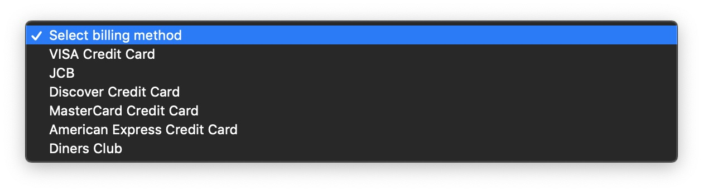
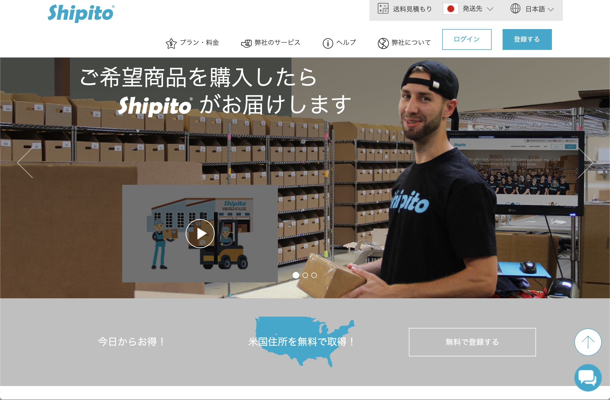
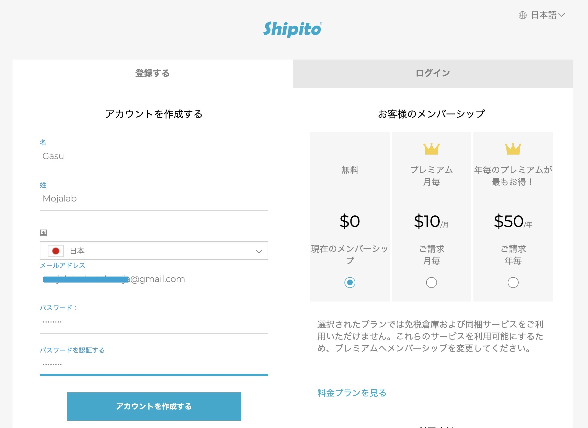
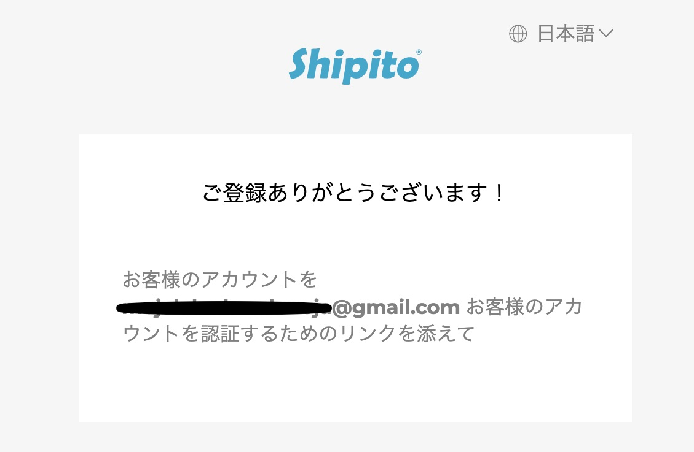
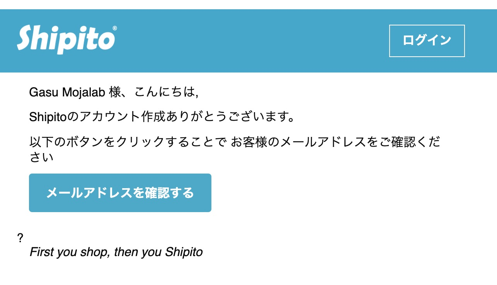
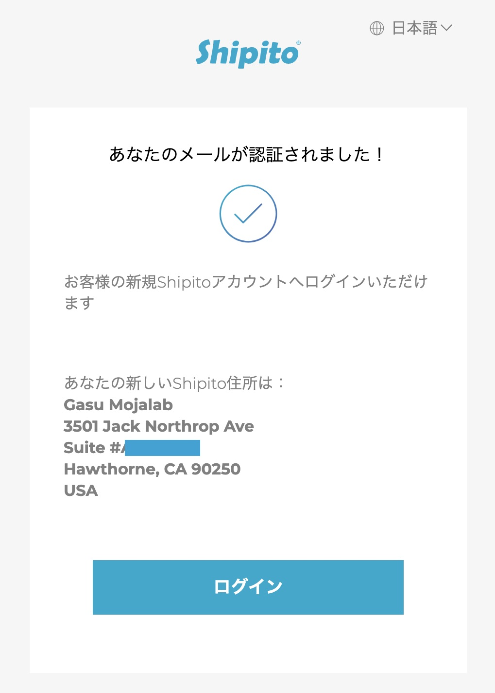

アローラ！ 
 
かれこれ２ヶ月前のことになるけど、__アメリカのポケモンセンターオンラインで買い物して日本に個人輸入した時のことをまとめておこうと思う__。。。 
ちょっと長くなるので前編後編に分けて話すよー！ 
 
 
今回は__購入準備編__！ 
 
 
アメリカのポケモンカードのサプライ（スリーブやデッキケースなどの周辺商品）を買うにはアメリカのポケモンセンターで購入しなければいけないが、我々庶民がふらっとアメリカに行けるわけでは当然ないわけで、通販購入になるわけなのだが。。。 
 
まず海外のポケモンセンターで買い物をするには、クレジットカードもしくはデビットカードが必要になります！対応してるカード会社は以下掲載 

- VISA
- JCB
- Discover Card
- MasterCard
- American Express
- Diners Club

日本のクレジットカードの大半はJCBかVISAだと思います。 
クレジットカードを所有してない方は審査も無いデビットカードを作ると比較的すぐカードを作れると思います！ 
ちなみに私はVISAデビットカードで買いました！クレカはついつい使いすぎるので浪費癖がある人にはデビットカードおすすめです（笑 
 
そしてここからが鬼門なんだが、[__ポケモンセンターオンライン__](https://pokemoncenter.com)__は海外発送非対応__なんです！！ 
(2019年6月時点) 
一応リンク貼っとくね→[pokemoncenter.com](https://pokemoncenter.com) 
 
じゃあ、どうやって個人輸入すんのかっていうと 
 
__海外の転送サービスを利用します！！！__ 
 
転送サービスと言っても山ほどそんなサービスやってる会社があるので、各会社のHPを読んで気に入った会社を利用するといいと思います！ 
中には購入代行サービスをやってる会社もあるので、英語に不安がある方はそういう会社を選ぶと良いと思います！ 
ちなみに私は英語苦手ですが大丈夫でした（笑 
 
今回私が利用した転送会社はこちら→[Shipito](https://www.shipito.com/ja)
 
 
髭面のお兄さんが笑顔で出迎えてくれました（笑 
 
このサイトを選んだ理由としてはサイトデザインが好みだったから（爆 
というのもありますが、、、 
- 登録料無料
- 必要に応じて課金プランもありサービスが豊富
- 利用手数料が比較的安い（と感じた）

とりあえず安く済ませたかったんですよ（笑 
というわけで早速登録していきましょう！ 
トップ画面の「登録する」ボタンをクリックして登録画面に移りましょう！ 

姓名はなるべく実名で登録した方が間違い無いでしょう 
パスワードは__大文字小文字のローマ字、数字、記号がそれぞれ最低１文字ずつ必要__なので注意してください 
 
登録ができましたら以下の画面になります 

この画面表示後に登録したメールアドレスに確認メールが来ます 

メールアドレスの確認が終わると転送元となるアメリカ住所がもらえます！ 

以上で登録完了です！ 
 
次回は[ポケモンセンターオンライン](https://pokemoncenter.com)での購入方法をお話いたします！！ 
 
[注文編はこちら](https://www.mojalab.site/gasu/20190625) 
 
ではまた次回！！
