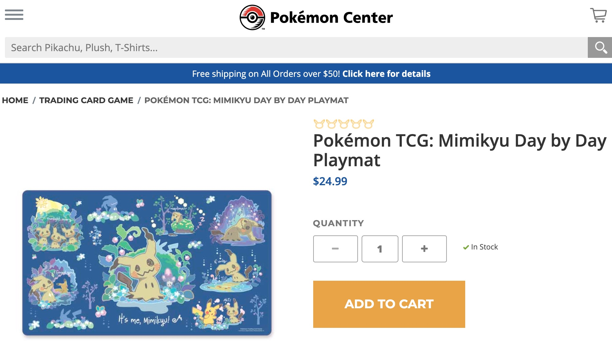
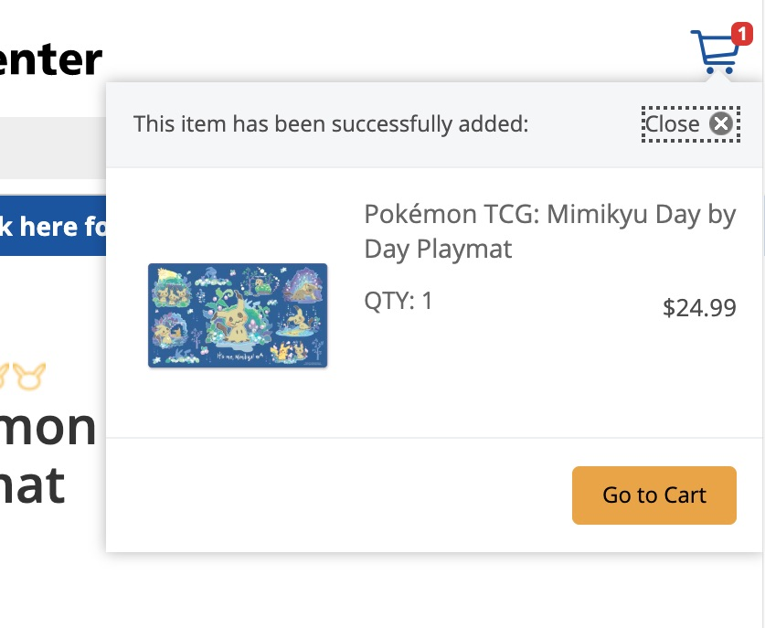
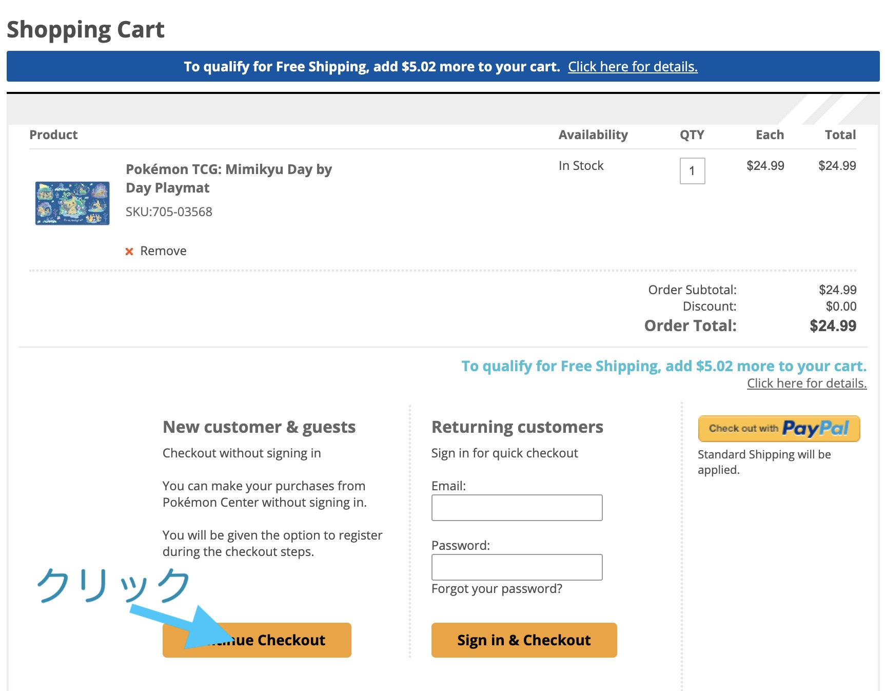
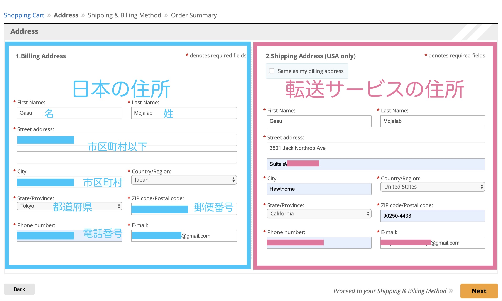
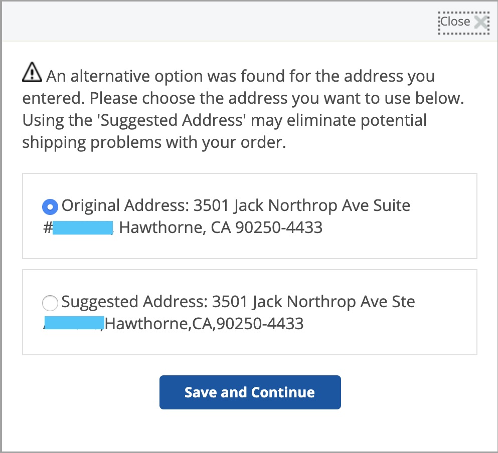
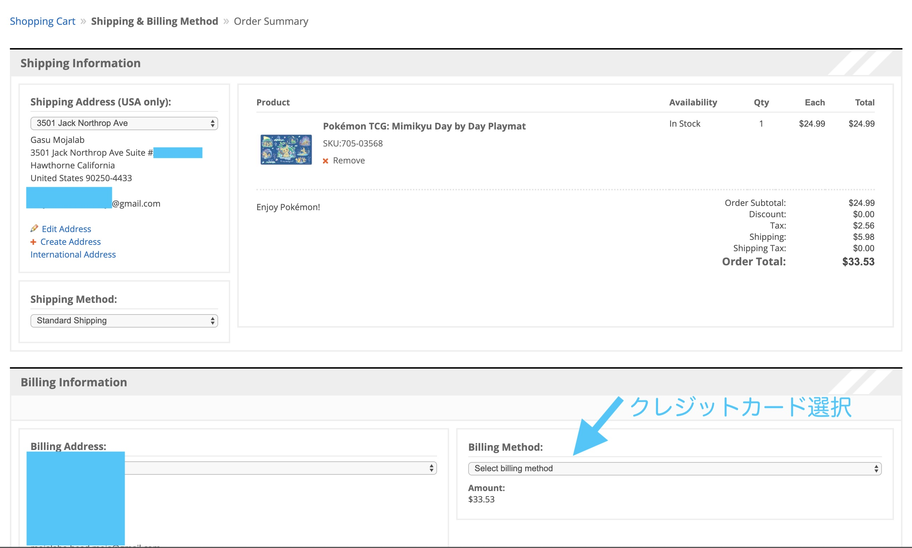
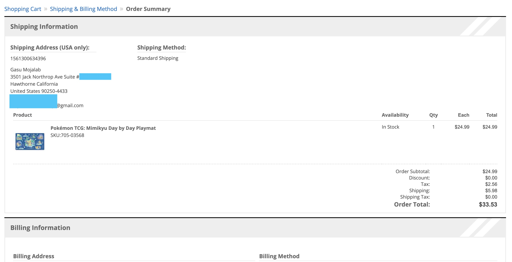
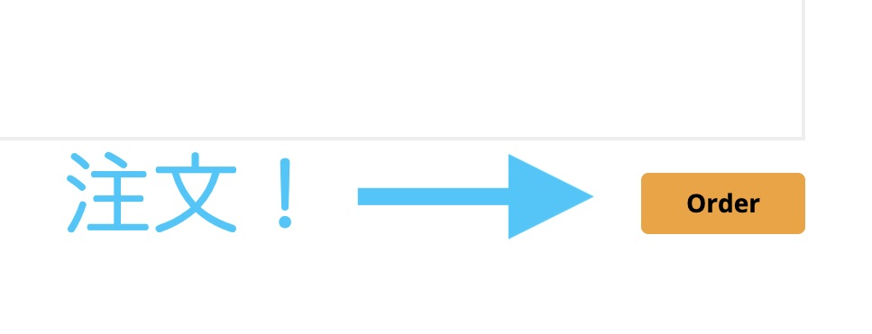
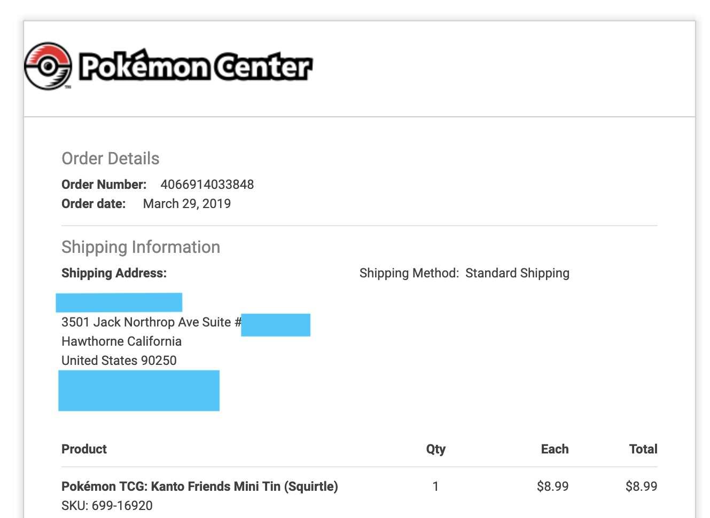

アローラ！！ 
 
さぁ、前回に引き続き日本からアメリカの[ポケモンセンターオンライン](https://pokemoncenter.com)で買い物をする方法をまとめますー！ 
 
今回は注文編！実際に購入していきましょう！！ 
 
前回の準備編をまだ読んでない方は[__こちら__](https://www.mojalab.site/gasu/20190621) 
 
 
では早速[ポケモンセンターオンライン](https://pokemoncenter.com)でほしい商品をカートに入れましょう！！ 
買いたい商品のページに行き「ADD TO CART」をクリック！ 
 
 
 
そうしたら、右上の買い物カゴに商品が入ります
 
 
まぁ普通のネットショッピングと一緒ですよね（笑 
輸入費で4000円くらいはかかるので、こまめに買うよりまとめて買うのが１商品あたりの値段を抑えられておすすめです！ 
お友達同士で相談して一括注文とかもいいと思います！ 
僕も注文する時は有志募集して買いました（笑 
 
 
購入したい商品が全てカートに入ったら「Go to Cart」をクリックしましょう 
「Shopping Cart」画面に来たらカートに入ってる商品を確認し、問題なければ「Continue Checkout」クリック！ 
ちなみに、今回は初回購入を想定してるので「Continue Checkout」をクリックしますが、既に会員登録をしてる場合は「Sign in & Checkout」で大丈夫です！ 
定期的に購入する方は登録した方が入力を省略できていいと思います 
 
 
 
発送先住所を入力していきます。 
 
**左側が注文者の住所（日本の住所）** 
**右側が発送先住所（転送サービスの住所）** 
 
となるように入力して「Next」をクリック！ 
氏名、電話番号、E-mailは同じもので大丈夫です 
日本の住所をどうやって入力するのかわからない方は変換サイトなどを参考にして入力してください👉[参考サイト](http://judress.tsukuenoue.com/) 

 
 
住所間違ってんじゃねぇの？って確認出ますが、そのまま強行してもちゃんと届いたので「Original Address」選択で大丈夫です！（Shipito利用の場合） 
そのまま「Save and Continue」をクリックで進みましょう 
 
 
 
注文確認に到達しましたら商品と住所の再確認です。 
問題なければクレジットカードを選択し、必要事項を入力しましょう。 
入力が完了しましたら「Next」をクリック！ 
 
 
最終確認画面が出ればクレジットカードの入力は大丈夫です！
 
 
 
いよいよ注文ですよー「Order」をクリックで注文確定しましょう！！ 
 
 
 
こんな感じの注文メールが届けば、注文完了です！！ 
 
 
 
いかがだったでしょうか？ちょっと細かすぎるかなぁとは思いましたが、これを読んで少しでも注文の不安が解消できたら幸いです。 
説明が長すぎて書ききれなかったので、次回転送編書きます！！ 
 
ではまた次回！！
