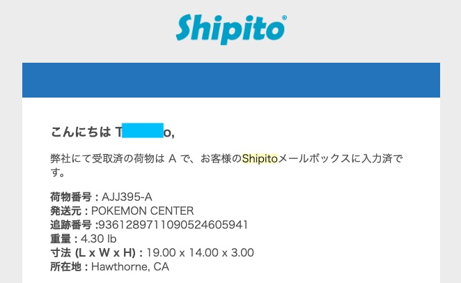
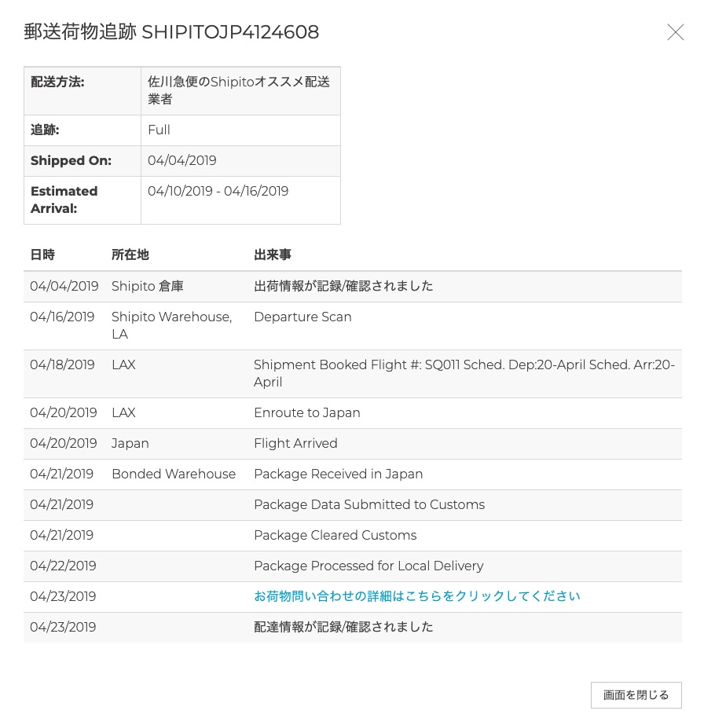
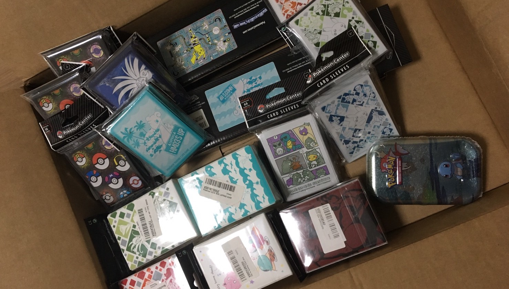

アローラ！！ 
 
今回で連載してたポケカ個人輸入シリーズも最後になります！！ 
 
過去の記事をまだ読まれてない方はこちら 
前々回の[準備編](https://www.mojalab.site/gasu/20190621) 
前回の[注文編](https://www.mojalab.site/gasu/20190625) 
 
 
**※この記事はShipitoで注文した際の確認方法や家に届くまでにどんなことが起きたのかを載せております。** 
 
アメリカの[ポケモンセンターオンライン](https://pokemoncenter.com)で買い物をすると、発送連絡もなく勝手に発送されます（笑 
なので、購入後最初に動きがあるのは転送会社から荷物が届いたという知らせになります。 
以下の様なメールが私の時は来ました！ 
 
 
予想外にも日本語のメールが来ました！（笑 
このメールが来ましたらShipitoのサイトにログインし、発送手続きをします。 
 
当時の操作画面が残ってないので、発送手続きに関しましてはわかりやすく説明していただいてるサイトのリンクを貼るので、そちらを参考にしてください（汗 
後日また個人輸入した際には、自分のやり方を画面のスクショと合わせてこの記事に加筆修正致します！ 
万が一不明点があればTwitterでDMくださればお答え致します。 
参考サイトはこちら→[teketakeのブログ](http://teketake.hatenablog.com/entry/2019/03/02/060435)様 
 
Shipitoのサイトの見方は以下の様になってます。 
- **倉庫の荷物**
  - _要入力_ 
    転送会社に荷物が届くとここに荷物の情報が入り、発送先と発送方法を選びます。 
    複数荷物がある場合は同梱の手続きなどもこのステータスの時にできたと思います。 
    （同梱手続きは未経験なので間違ってたらごめんなさい。） 
    主な入力内容は発送先の住所の入力と内容物の登録です。 
    輸入なので内容物の記載は正確に書いた方が身のためです（汗 
     
  - _手配中_ 
    要入力ステータスから発送手続きが終わる（発送の支払い完了まで）と荷物がこのステータスに写ります。 
    このステータスで特にこちらが行うことは基本的にありませんが、内容物によってはShipitoから質問が来ます。 
    私の場合「ポケモンカードゲーム〜」という商品名のものを１７点購入したせいなのかわかりませんが、業務仕入れ用か？って再確認されました（笑 
    発送時の入力項目でもプライベート用だって答えてたんですがね。。。 
     
  - _出荷準備中_ 
    上記までに不備がなければこちらのステータスに移ります。 
    ここま待つだけになると思います。 
     
- **出荷済荷物**
  - _配送中_ 
    荷物が発送されるとこちらのステータスに移ります。 
    私の場合、速達の追加料金も払ってなかったからなのかわかりませんが、ここからが長かった。。。 
    おそらく荷物の検査とかしてるんでしょうが、ここは忍耐です（笑 
    ２週間しても変化がなければ問い合わせてみるのもいいと思います。 
    ちなみに私は１週間音沙汰無しだったので問い合わせましたが、どうやらShipito側も税関検査で何やってるのかは把握できないらしいので２週間は覚悟した方がいいって言われました。 
    日本に送られる際は何日のどの飛行機に載せて輸入するかも教えてくれるので、飛行機の情報が表示されるまでは税関検査待ちという事になります。 
    下の方に追跡ログを掲載するので参考にしてください。 
     
  - _到着済_ 
    日本に荷物が到着すると、こちらのステータスに移ります。 
 
 
実際の荷物の発送手続きから日本に届くまでにかかった日数はこちらです。 
 
 
これ見てわかる様に、4/4に発送手続きしてから4/16までの12日間は音沙汰無し期間ですよ？！ 
まじで不安でした（笑 
これと同時期に３Ｄプリンターを中国から個人輸入してたんですが、そっちは１週間くらいですぐ届いたから尚更不安になってましたね。。。 
 
 
ともあれ届いたのがこちら！！ 
 
 
って、一番上に掲載してるから散々見てるって感じですよね（笑 
 
最後に今回掛かった費用を載せておきます！おそらく費用面が一番気になるところかなと（笑 

|||費用|
|:---|---:|:---:|
|購入商品|デッキケース ５個 スリーブ ９個 プレイマット ２個 ミニ缶 １個|$182.85 (20,879円)|
|輸入費|送料 小売売上税 手数料|$42.99 (4,842円)|
|国内費用|関税 消費税 手数料|1,324円|
|合計||27,045円|

総括すると。。。まとめて欲しい商品がある場合は個人輸入した方が安くなりますが、１個２個欲しいものがあるだけなら２倍くらいで国内で転売されてる物を買った方が安くなるという結果が出ました！ 
なかなか面白かったので、また機会があれば利用してみたいと思います！！ 
 
ではまた次回違う話題で！
