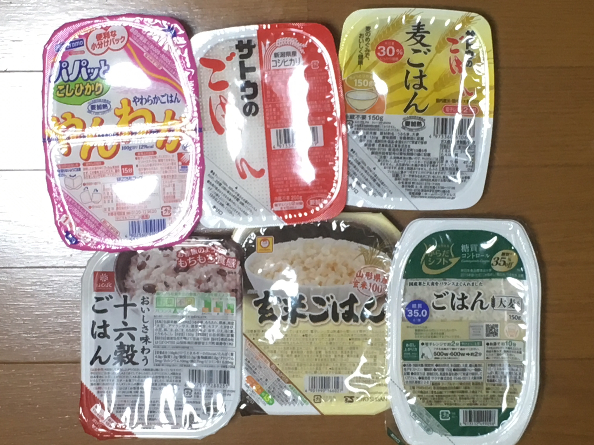

遅ればせながら、私もじゃもブログ始めましたー！

さてさて、今回はもじゃブログ第1回ということでブログで何するよ？  
ってことを考えていきたいと思いまーす！  

まぁ日常のことを適当に書けばいいじゃん！ってなるかもしれないですが、  
私そういったことはあんまり得意じゃないので、  
そうすると三日坊主になること間違いなし！なんですよね  

なんで、自分らしくて、自分が書きやすくて、続けていける何をテーマにして  
日々ブログを書いていこうかなと思っておる次第なのですよ  

で、じゃあ 『もじゃ』 らしいものって何よってなるわけですよ。  

自分なりに考えた結果・・・  
#### **ご飯！**　  
すなわち  
### **白米（ライス）**  
ではないかなと！  

私は何を隠そう、パンよりも麺よりもご飯が大好きです！  
毎食ご飯でもいいよって思いますし、  
朝ご飯は、白飯に納豆に味噌汁が最強だと思ってます  

東京近郊に住む２０代、４０代、６０代の人を対象に最近行ったある調査では  
朝食で食べるものは  
20代男性はご飯派であり、逆に  
女性は8割以上がパン派なんですって  
↓  
[昭和世代と平成世代の「食」習慣に関する調査](https://kyodonewsprwire.jp/release/201904245767)

そう言われるとご飯って食べられている層が分かれてくるのかなとも思いますが  
朝食はパンでもやっぱり昼食となると、  
「ごはんとおかず（定食）」が年代や性別を超えて人気だし、  
若い世代ほど男女に関わらず「おにぎり」が好きなんだとか！  

この調査結果を真に受けると  
ご飯の記事はいろんな人が気になるところなんじゃないかなと思ったりするわけですよ  

そんな白米ですが、ご飯は好きで、おにぎりとか外食で定食や丼はよく食べるけど、  
手間がかかるし、炊いてまではご飯食べないかなーって人も多いのではないかな  
と私は妄想してます。  
だって、お米研いで、炊飯器に入れて３０分〜４０分ぐらい待ってようやく食べれるようになるわけですし  
手間も時間もかかります。

でも、そんな *面倒くさがり* さんでも手軽にご飯を食べれるものがありますよね？

そうです！  
### レトルトご飯      
です！  

レトルトご飯ならレンジでチン！するだけで美味しい白米の出来上がり〜な訳です！

はい。それでは前置きが色々長くなりましたが・・・  
もじゃが色々と考えた末に結論を出した   
もじゃのブログでの記事のメインテーマはこちら！  

## レトルトご飯レビュー  
です。

今レトルトご飯は様々なメーカーから多種多様なものが発売されています。  
  
なので、それをもじゃが食べて、これはこんな感じだったよ  
と私なりに頑張ってレビューしていきたいと思います！  
(食レポ下手ですが、頑張ります！！ww)  

レビューをみて、  
「あっちのレトルトご飯にしよ」  
「今日はパンはやめてご飯にしよっかなー」  
みたいな人が出てきてくれることを目標にして頑張っていきたいと思います！！  

以上の通り、中心となるのは「レトルトご飯レビュー」でやっていきたいと思いますが、  
他にも「3Dプリンタ X-smartの使い方」や「初めてのDTM」などの  
記事もおいおい書いていけたらなと思っていますw  

というわけで、次回から「レトルトご飯レビュー」始めていきますよ！  
# **乞うご期待！！**
