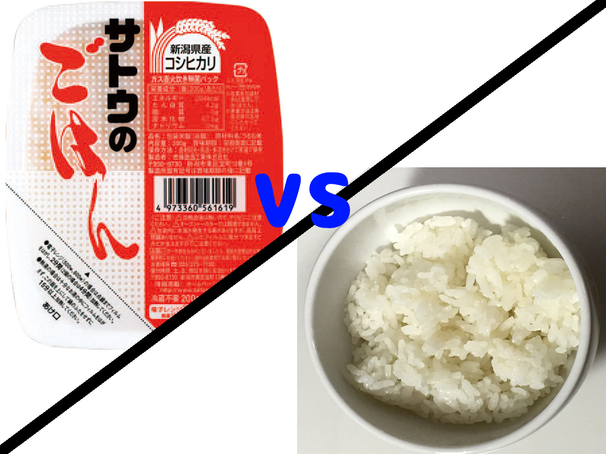
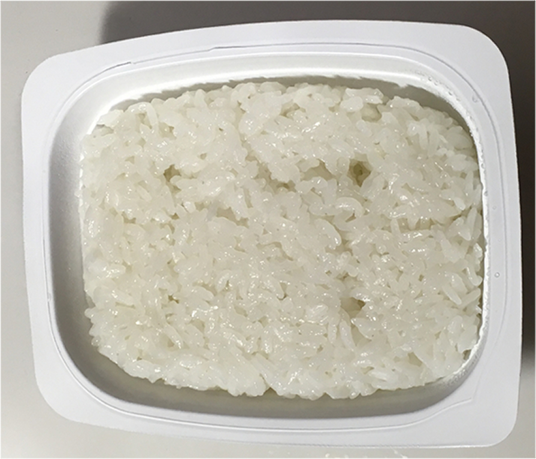
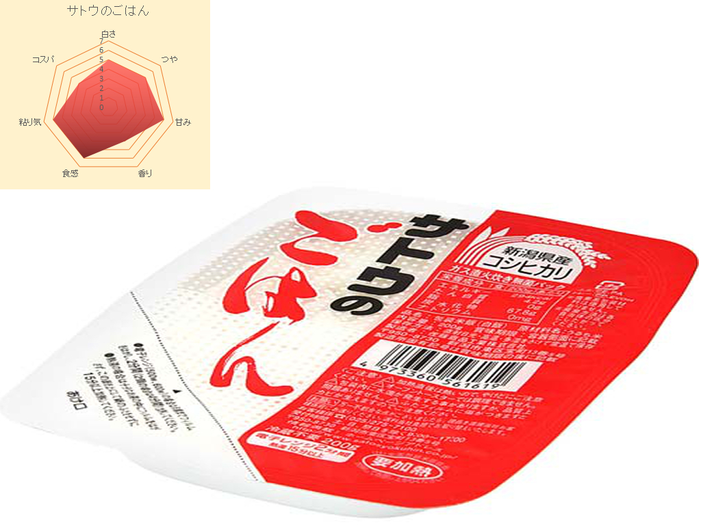

どーも！モジャラボのもじゃです！  

もじゃブログ第2回目になります！今回は前回にお話ししたように、  
もじゃのもじゃによる『レトルトごはん』のレビューを行いたいと思います！  

レトルトごはんレビューの映えある最初を飾るのは、  
レトルトごはんの代名詞とも言えると言えるこちら！  
## **サトウのごはん**  
です！  
　　

　　
さて、レトルトごはんのレビューはどうやってしていくかという話ですが、
何個かの項目を設けて、それに対して、  **7点満点** で評価していこうと思います  

さてみなさん。そもそも ** どういうものが美味しいごはん ** と言えると思いますか？  

色々と調べたところ、  
[お米アドバイザーのページ](http://www.okome-adv.jp/knowledge/cat4/post-100.html)にこんなことが書かれていました。  
> 日本人が感じる美味しいごはんの条件は    
>『色が白く、光沢があり、無味に近いがほのかな甘みと風味が感じられる。舌触りがなめらかで軟らかく、噛むと粘りと弾力がある。』  
>とこれまでの研究でまとめられています。  

ふむふむ。  
これを元にどういった基準で判断していくかと考えると以下のような観点になりますかね  
1. **白さ**   
2. **つや**   
3. **甘み**   
4. **香り**   
5. **食感（舌触り）**   
6. **粘り気**   
そして、これに加えて商品のレビューということになるので  
値段と量と美味しさを加味して評価する   
7. **コスパ**   
の7つの指標でレビューしていきたいなと考えています。  

とはいえ、どの指標も食べる人の嗜好によって変わってくるものだと思いますので  
あくまでも、 もじゃの独断と偏見による評価 というところはご了承くださいませ  

***

はい。では、前置きが長くなりましたが、いよいよレトルトごはんレビューに参りましょう！

評価をする上で、比較をした方が判断かつきやすいかなと思いましたので、  
レトルトごはん **『サトウのごはん』** と  
安い炊飯器で炊いたご飯を冷凍しておいた **『冷凍ごはん』** とで比較をしていきたいと思います。  

  

冷凍ごはんもレンジでチンして解凍すれば食べれるので、レトルトごはんと同じぐらいにお手頃なものかな  
と思い、今回対象にさせてもらいました。  

***

ではでは、早速『サトウのごはん』を電子レンジでチンしていきましょう！  
レンジでチンしてきたサトウのごはんはこんな感じです！  
↓  

  
うん！美味しそうですね！  
さてさて、それではちょっと比較していきましょうか！   

まず見た目いう観点では冷凍ご飯は少し黄ばんでいました。  
時間が経過するとご飯は黄ばんでしまうということだったので、冷凍して時間が経過してしまったということなんでしょう。  
対してのサトウのごはんはちゃんといい白さをしていました。  
つやに関しても冷凍ごはんと比較するとツヤ感は圧倒的にサトウのごはんの方がよかったですね  

次に食べた感じですが、甘み、食感、粘り気については、  
圧倒的にサトウのごはんの方が美味しかったです！  
噛めば程よい甘味を感じ、するっと食べられて、程よい粘り気があり、ご飯だけ食べても全然いけます！  
一方の冷凍ごはんですが、甘味も弱く、そして全体的にパサパサしているって感じで  
おかずとかと一緒に食べるのであれば誤魔化せるかもしれませんが、ご飯だけで食べるのはちょっと…という感じでした  

香りについては、ちょっとごはんの香りを今まであまり感じて来なかったのか、    
はたまた鼻が詰まっているだけなのか、あまり二つのに差は感じませんでした。  

最後にコスパという面では  
サトウのごはんは  **200gで148円(税抜)** で  
冷凍ごはんは **5Kg1480円** のお米を炊飯したので、冷凍ごはんの方が当然コスパはいいですよね  

というわけで、これらを踏まえて点数をつけるとこんな感じです！  

  

1. 白さ・・・　5点  
2. つや・・・　5点  
3. 甘み・・・　6点  
4. 香り・・・　4点  
5. 食感・・・　6点  
6. 粘り気・・・6点  
7. コスパ・・・4点  

というわけでレトルトごはんのレビューでした！

レビューのまとめをすると、コスパということを考えると冷凍ごはんの方が良いですが  
手軽においしいご飯を！ってことを考えると、   
 『サトウのごはん』が圧倒的に良いと思います！  
『サトウのごはん』はスーパーとか、場所によってはコンビニとかでも売っていると思いますので  
手軽でおいしいごはんを食事のお供にいかがですか？

第1回ということで正直探り探りなところはありますが、  
続けていくことで徐々に色んなものの精度を上げていければなと思います！

さぁてと、次はどのレトルトごはんのレビューをしよっかなー（笑）  
